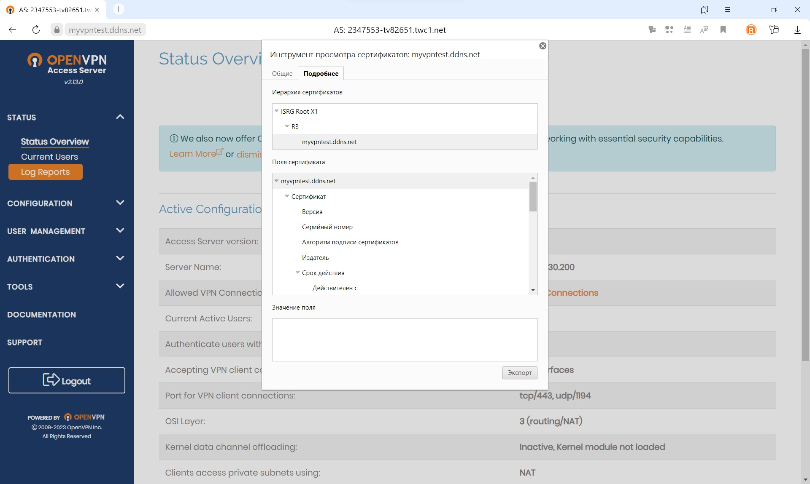

## Сертификат

## Настроенная сеть

### Office1:
- PC0:
- - IPv4: 192.168.0.10 255.255.255.0
- PC1:
- - IPv4: 192.168.0.11 255.255.255.0
- - Gateway: 192.168.0.1

### Office2:
- WEB HTTP Server:
- - IPv4: 10.0.0.10 255.255.255.0
- - Gateway: 10.0.0.1
- WEB HTTPS Server:
- - IPv4: 10.0.0.11 255.255.255.0
- - Gateway: 10.0.0.1
- 
### Интернет
- Router0:\
\
\
- Router1:\
\
- Router2:\
\
- Router3:\
\
\
- DNS Server:
- - IPv4 : 8.8.8.8 255.255.255.0
- - Gateway: 8.8.8.1

### Port forwarding:

### DNS:

